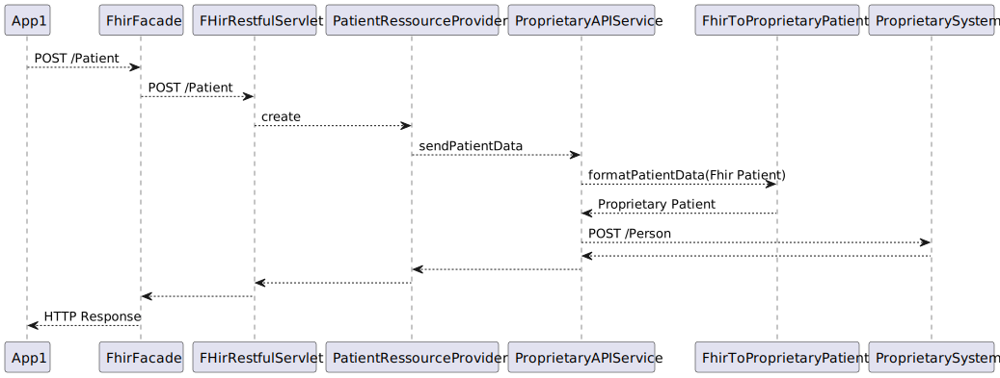

# Getting Started 🚀

Dieses Repository enthält die Implementierung der HL7 FHIR R4 Facade der Plattform xy.

### Voraussetzungen zum Entwickeln

- JDK 17 (Minimum)
- Apache Maven 3.x
- Entwicklungsumgebung

### Übersicht

Die vorliegende Softwarekomponente hat folgende Verantwortlichkeiten:

- Annahme von HTTP Requests nach HL7 FHIR - Standards von diversen als "App" bezeichneten Subsystemen
- Validierung der Ressourcen bzgl der unterstützten Profile
- Konvertierung von Datenformaten für vorhandene Primärsysteme

Die folgende Grafik zeigt einen Überblick:


Die Folgende Grafik zeigt einen Überblick über die Interaktion der wesentlichen Bestandteile am Beispiel eines Uploads einer
Patienten-Ressource



### Konfiguration der Umgebung

Das in der Grafik als ProprietarySystem bezeichnete System ist über eine URL
Erreichbar. Die Basis-URL (entweder zum Echtsystem oder zu einem Mock) muss
für die Entwicklung in der Datei application-dev.properties eingestellt werden (Property legacySystemOneURL). Der server-Port gibt an über welchen Port sich die Apps (Postman, Insomnia usw) mit der Facade verbinden:

```properties
server.port=8080
legacySystemOneURL=http://localhost:3001
```

### Starten

Folgender Befehl baut diese FHIR Facade und führt anschließend die Tests aus.

```bash
mvn package
```

Ergebnis ist eine jar-Datei im /target - Verzeichnis. Starten kann man die Anwendung dann z.B. so:

```bash
java -jar target/fhir-facade-0.0.1-SNAPSHOT.jar
```

### Erweiterung

Um eine neue unterstützte FHIR-Ressource hinzuzufügen, die eine Konvertierung in ein Legacy-System erfordert:

- Bereitstellung einer Konvertierungs-Funktion
- Bereitstellung eines Ressource-Providers

// TODO

### Contributing

// TODO

#### Checkstyle etc.
